# What's Happening

## Table of contents

* [About What's Happening](#about-what's-happening)
  * [UH Manoa Community Problem](#uh-manoa-community-problem)
  * [The What's Happening Solution](#the-whats-happening-solution)
* [Initial User Study](#initial-user-study)
* [Installation](#installation)
* [Application design](#application-design)
  * [Directory structure](#directory-structure)
  * [Import conventions](#import-conventions)
  * [Naming conventions](#naming-conventions)
  * [Data model](#data-model)
  * [CSS](#css)
  * [Routing](#routing)
  * [Authentication](#authentication)
  * [Authorization](#authorization)
  * [Configuration](#configuration)
  * [Quality Assurance](#quality-assurance)
    * [ESLint](#eslint)
* [Development History](#development-history)
  * [Milestone 1: Mock-up Development](#milestone-1-mock-up-development)
  * [Milestone 2: Basic Functionality](#milestone-2-authentication-collection-and-google-maps-integration)
  * [Milestone 3: Functional Profile and Event Pages](#milestone-3-functional-profile-and-event-pages)

## About What's Happening

### UH Manoa Community Problem

There isn’t a consolidated place where all events on campus can be posted and viewed easily. Event postings are scattered across different media. As a result, promoters have to work hard to get the word out, and consumers have to work hard to search for these events.

Here's an example:


Try finding the flyer for the film festival. It's not very obvious, is it?

### The What's Happening Solution

An application where students can both post and view events that are scheduled or happening on campus. You can visit the website live [here](http://whats-happening-uhm.meteorapp.com)! Below is a guided tour of how a new user might interact with our app.

Upon arrival to the site, you are created by the landing page below.


New users click the `Sign Up & know What's Happening` button to direct them to the login page. You can also click the `Login` item in the menu bar.


Upon clicking, you proceed to the homepage.


Upon logging in, you will be greeted with the profile setup below if you are a new user.

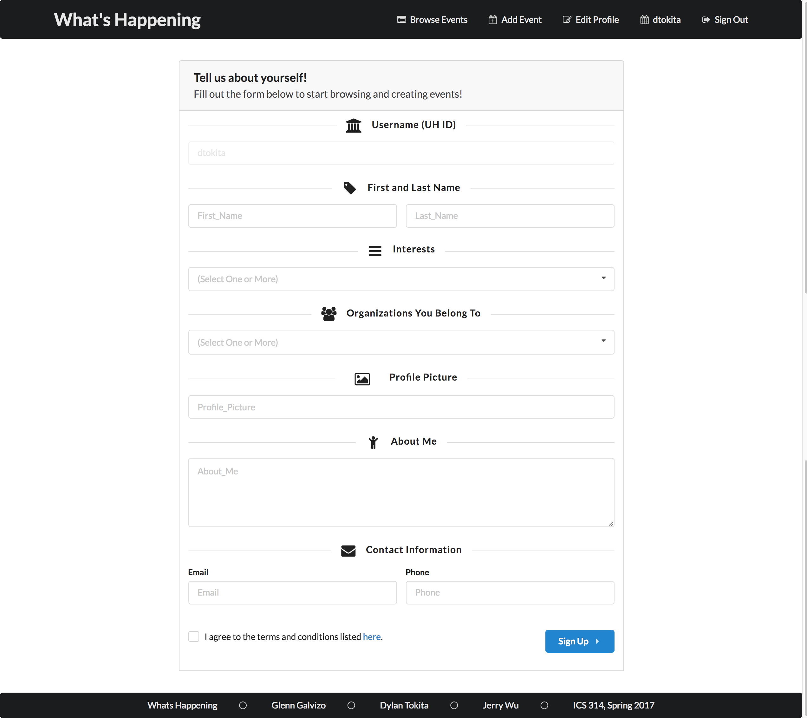

Once you have a profile setup, you are directed to the home-page. If you are not logged in, the same events will be displayed but you will not have the option to list events, save events, or edit your profile in the header bar.


Note that you can also get to this page by clicking `Find Out What's Happening` in the landing page, `Browse Events` in the header bar, or `What's Happening` in the header bar.

You can click on event to view more information. From here, you can click the upper right star to save an event, inform the organizer you are attending, or edit the event if you listed it.

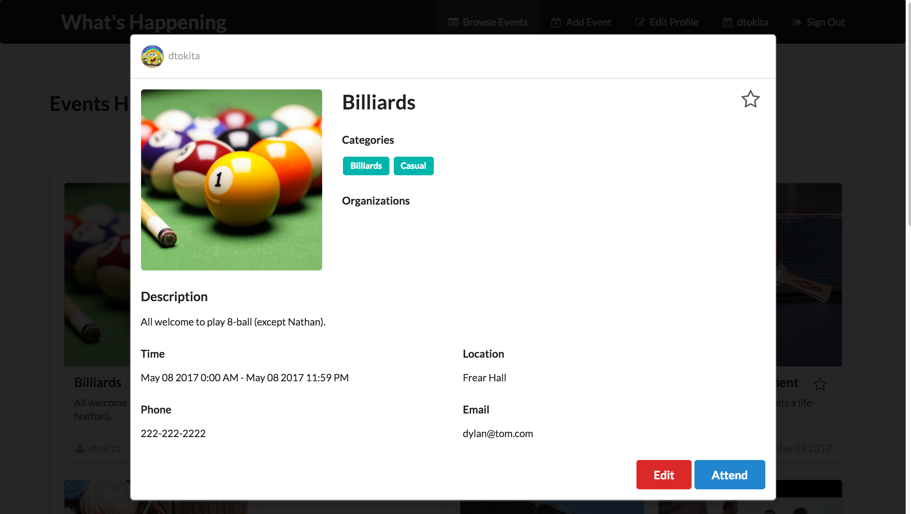

To view all public information associated with you, click your UH username in the header bar. You can view all the events you listed, plan-to-attend, or saved by clicking the appropriate tabs.

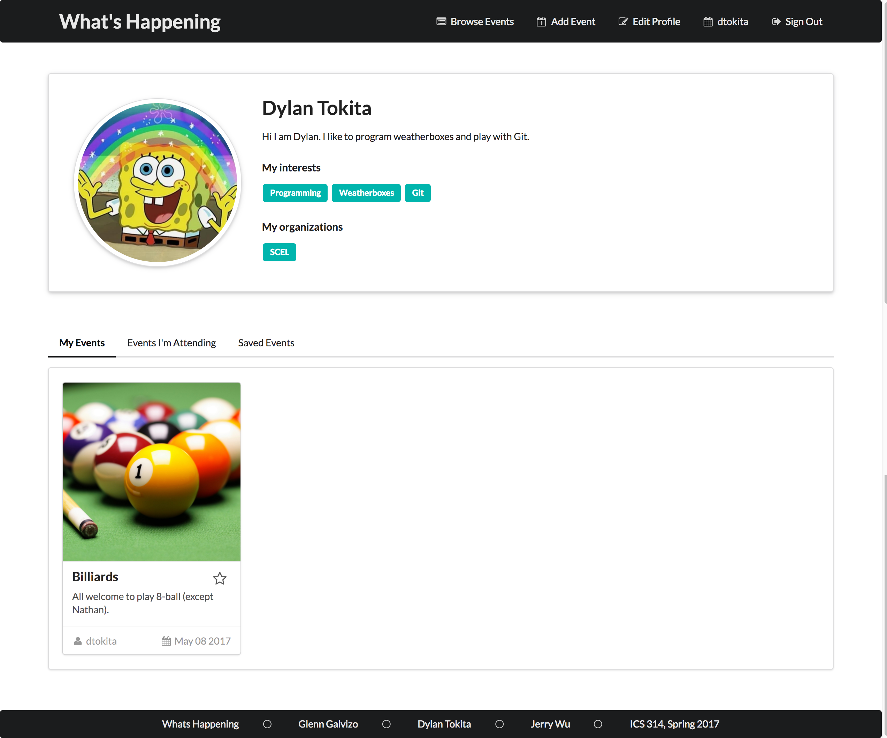

To list an event of your own, click `Add Event` in the header. 

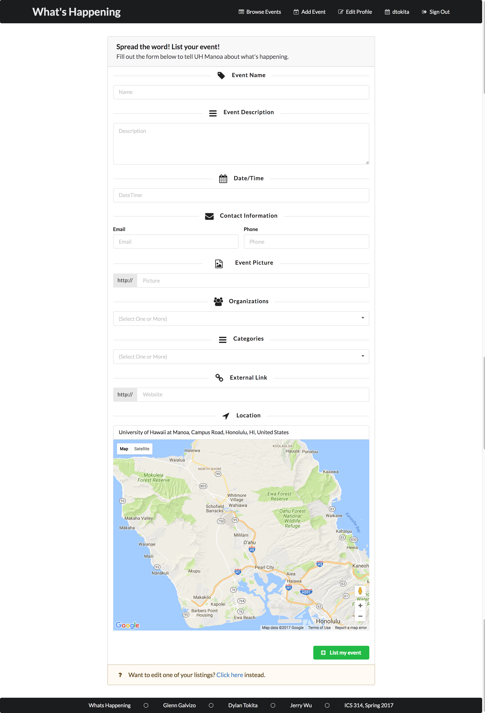

If you need to edit your profile, click `Edit Profile` in the header.

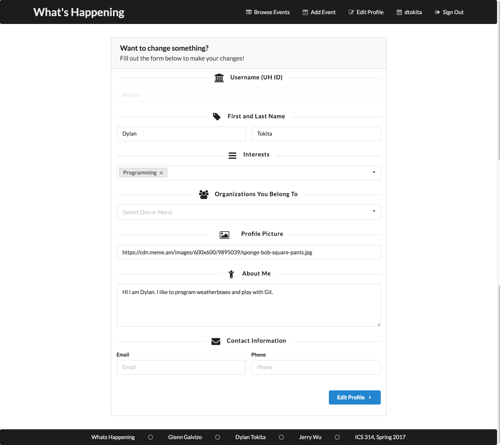


## Initial User Study

Our sample consists of reviews from five UH community members. Their backgrounds are:

1. Computer Engineering Student
2. Electrical Engineering Student
3. Biology Graduate, App Developer
4. Part Time Student, Accountant
5. Part Time Student, Personal Trainer

We requested that they perform the following actions in order:

1. Create and Setup a Profile
2. Browse Events
3. Save Events
4. Attend Events
5. Create an Event
6. Edit that Event
7. Edit their Profile

To summarize the positives, all of the users appreciated the simplistic and minimal UI. They felt it wasn't overwhelming, and that performing all of actions above were intuitive.

Areas of improvement include event filtering/searching and form submission. One user reported that he would've liked some sort of search on the homepage.

Two were having trouble trying to submit their events, as the form validation errors were not visible enough. A suggestion to avoid this issue was to make the screen scroll up to any errors, or to split the page into two pages, so all the fields are visible.

Some users reported having trouble setting up an account. The website still had some bugs that needed to be worked out.

## Installation

First, [install Meteor](https://www.meteor.com/install).

Second, clone our repository [here](https://github.com/whats-happening-uhm/whats-happening-uhm).

Third, cd into the app/ directory and install libraries with:

```
meteor npm install
```

Fourth, run the system with:

```
meteor npm run start
```

Last but not least, visit the application at [http://localhost:3000](http://localhost:3000). If you have an account of the UH test CAS server, you can login.

## Application Design

### Directory structure

The top-level directory structure contains:

```
app/        # holds the Meteor application sources
config/     # holds configuration files, such as settings.json
.gitignore  # don't commit IntelliJ project files, node_modules, and settings.json
```

This structure separates configuration files (such as the settings files) in the config/ directory from the actual Meteor application in the app/ directory.

The app/ directory has this top-level structure:

```
client/
  lib/           # holds Semantic UI files.
  head.html      # the <head>
  main.js        # import all the client-side html and js files.

imports/
  api/           # Define collection processing code (client + server side)
    events/
    profiles/
  startup/       # Define code to run when system starts up (client-only, server-only)
    both/
    client/        
    server/        
  ui/
    components/  # templates that appear inside a page template.
    layouts/     # Layouts contain common elements to all pages (i.e. menubar and footer)
    pages/       # Pages are navigated to by FlowRouter routes.
    stylesheets/ # CSS customizations, if any.

node_modules/    # managed by Meteor

public/          
  images/        # holds static images for pages.

server/
   main.js       # import all the server-side js files.
```

### Import conventions

This system adheres to the Meteor 1.4 guideline of putting all application code in the imports/ directory, and using client/main.js and server/main.js to import the code appropriate for the client and server in an appropriate order.

This system accomplishes client and server-side importing in a different manner than most Meteor sample applications. In this system, every imports/ subdirectory containing any Javascript or HTML files has a top-level index.js file that is responsible for importing all files in its associated directory.   

Then, client/main.js and server/main.js are responsible for importing all the directories containing code they need. For example, here is the contents of client/main.js:

```
import '/imports/startup/client';
import '/imports/startup/both';
import '/imports/api/profiles';
import '/imports/api/events';
import '/imports/ui/layouts';
import '/imports/ui/pages';
import '/imports/ui/stylesheets/style.css';
import '/imports/ui/components/form-controls';
import '/imports/ui/components/landing';
```

Apart from the last line that imports style.css directly, the other lines all invoke the index.js file in the specified directory.

We use this approach to make it more simple to understand what code is loaded and in what order, and to simplify debugging when some code or templates do not appear to be loaded.  In our approach, there are only two places to look for top-level imports: the main.js files in client/ and server/, and the index.js files in import subdirectories.

Note that this two-level import structure ensures that all code and templates are loaded, but does not ensure that the symbols needed in a given file are accessible.  So, for example, a symbol bound to a collection still needs to be imported into any file that references it.

### Naming conventions

This system adopts the following naming conventions:

* Files and directories are named in all lowercase, with words separated by hyphens. Example: accounts-config.js
  * "Global" Javascript variables (such as collections) are capitalized. Example: Profiles.
  * Other Javascript variables are camel-case. Example: collectionList.
  * Templates representing pages are capitalized, with words separated by underscores. Example: Directory_Page. The files for this template are lower case, with hyphens rather than underscore. Example: directory-page.html, directory-page.js.
  * Routes to pages are named the same as their corresponding page. Example: Directory_Page.


### Data model

The What's Happening data model is implemented in two files: [Events](https://github.com/whats-happening-uhm/whats-happening-uhm/blob/master/app/imports/api/events/events.js) and [Profiles](https://github.com/whats-happening-uhm/whats-happening-uhm/blob/master/app/imports/api/profiles/profiles.js). Both of these contain a MongoDB collection with the same name and export a single variable (Profiles and Events) that provides access to that collection.

Attached to both collections are schemas which describe what an Event or Profile should hold. Form validation is much simpler this way, as there exists Mongo functions which check the data and returns what exactly what isn't valid.

### CSS

The application uses the [Semantic UI](http://semantic-ui.com/) CSS framework. To learn more about the Semantic UI theme integration with Meteor, see [Semantic-UI-Meteor](https://github.com/Semantic-Org/Semantic-UI-Meteor).

The Semantic UI theme files are located in [app/client/lib/semantic-ui](https://github.com/ics-software-engineering/meteor-application-template/tree/master/app/client/lib/semantic-ui) directory. Because they are located in the client/ directory and not the imports/ directory, they do not need to be explicitly imported to be loaded. (Meteor automatically loads all files into the client that are located in the client/ directory).

Note that the user pages contain a menu fixed to the top of the page, and thus the body element needs to have padding attached to it.  The landing page has a separate layout for header and body, whose elements are transparent.

### Routing

For display and navigation among its four pages, the application uses [Flow Router](https://github.com/kadirahq/flow-router).

Routing is defined in [imports/startup/client/router.js](https://github.com/ics-software-engineering/meteor-application-template/blob/master/app/imports/startup/client/router.js).

What's Happening defines the following routes:

* The `/` route goes to the public landing page.
  * The `/home` route goes to the public home page.
  * The `/profile/<username>` goes to a profile page associated with `<username>`, which is the UH account name.
  * The `/add-event-page` goes to a page where user can add to the Events collection.
  * The `/edit-event-page/<event-id>` goes to a page where a user can edit the event `<event-id>` if it belongs to their profile.
  * The `/user-setup` goes to a page where a user adds their profile to the Profiles collection.
  * The `/edit-profile/<username>` goes to a page where a user can edit their profile information.


### Authentication

For authentication, the application uses the University of Hawaii CAS test server, and follows the approach shown in [meteor-example-uh-cas](http://ics-software-engineering.github.io/meteor-example-uh-cas/).

When the application is run, the CAS configuration information must be present in a configuration file config/settings.json. This file typically holds sensitive information (database account and password) and has not been uploaded to git.

Anyone with a UH account can login and use What's Happening to create a profile and add events.

### Authorization

The landing, home, and profile pages are public; anyone can access those pages.

The add and edit pages require authorization: you must be logged in (i.e. authenticated) through the UH test CAS server, and the authenticated username returned by CAS must match the username specified in the URL.  So, for example, only the authenticated user `john-cena` can access the pages `http://localhost:3000/edit-profile/john-cena` and  `http://localhost:3000/edit-event/<john-cena's-event-id>`.

To prevent people from accessing pages they are not authorized to visit, template-based authorization is used following the recommendations in [Implementing Auth Logic and Permissions](https://kadira.io/academy/meteor-routing-guide/content/implementing-auth-logic-and-permissions).

The application implements template-based authorization using an If_Authorized template, defined in [If_Authorized.html](https://github.com/bowfolios/bowfolios/blob/master/app/imports/ui/layouts/user/if-authorized.html) and [If_Authorized.js](https://github.com/bowfolios/bowfolios/blob/master/app/imports/ui/layouts/user/if-authorized.js).

### Configuration

The config directory is intended to hold settings files. The repository contains no config/settings.json, but the layout of a file can be found here: [config/settings.development.json](https://github.com/bowfolios/bowfolios/blob/master/config/settings.development.json).

The [.gitignore](https://github.com/whats-happening-uhm/whats-happening-uhm/blob/master/.gitignore) file prevents a file named settings.json from being committed to the repository. So, if you are deploying the application, you can put settings in a file named settings.json and it will not be committed.

### Quality Assurance

#### ESLint

What's Happening includes a [.eslintrc](https://github.com/whats-happening-uhm/whats-happening-uhm/blob/master/app/.eslintrc) file to define the coding style adhered to in this application. You can invoke ESLint from the command line as follows:

```
meteor npm run lint
```

ESLint should run without generating any errors.  

It's significantly easier to do development with ESLint integrated directly into your IDE (such as IntelliJ).

## Development History

The development process for What's Happening conformed to [Issue Driven Project Management](http://courses.ics.hawaii.edu/ics314f16/modules/project-management/) practices. Our project is broken into _Milestones_. Each Milestone consists of _issues_ which correspond to 2-3 day tasks.

### Milestone 1: Mock-up Development

This milestone started on April 5, 2017 and ended on April 13, 2017.

The goal of Milestone 1 was to create a working landing page and several HTML pages to provide a mock-up of the pages in the system. The mock-up was created as a Meteor app, meaning that each page existed as a template and FlowRouter handled the routing to pages.

Mock-ups for the pages below were implemented during M1:


Milestone 1 was implemented as [What's Happening GitHub Milestone M1](https://github.com/whats-happening-uhm/whats-happening-uhm/milestone/1).

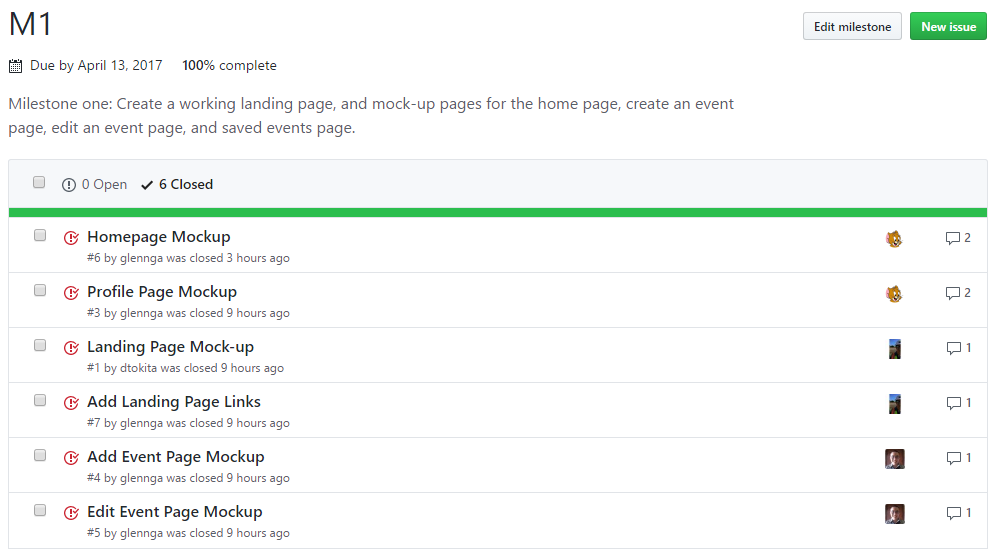

Milestone 1 consists of six issues, and our progress was managed with the [What's Happening GitHub Project M1](https://github.com/whats-happening-uhm/whats-happening-uhm/projects/1)

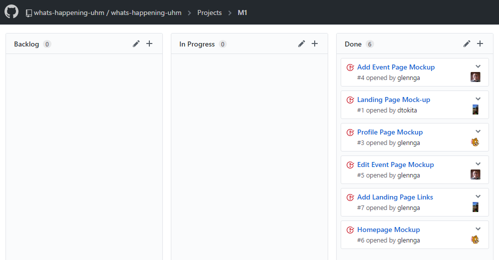

Each issue was implemented as its own branch, and merged into master when finished.

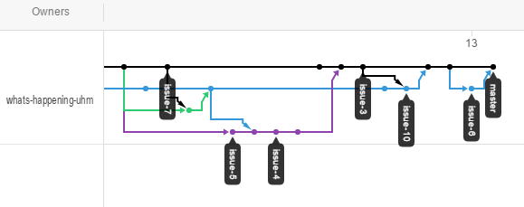

### Milestone 2: Authentication, Collection, and Google Maps Integration

This milestone started on April 13, 2017 and ended on April 27, 2017.

The goal of Milestone 2 was to integrate UH CAS authentication and Google Maps to our app, as well as create and tie Profile and Event collections into our UI. We also constructed two mockup pages for first time user setup and editing user's profile (interests, etc...), and updated the look of our current pages.

We updated our landing page to better inform the user what our app does. They can scroll down and see what events look like, modeled like how GitHub is. Users will now only be able to log in using their UH account by clicking the top left button in the menu bar, meaning that our users won't have to remember a new password to use our service.

To store our events and profiles, the Events and Profiles collections were created. These hold everything associated with a given event and profile. To store the interests and organizations, we have global lists that hold each item. These are in separate files, but are exported when needed.

A location and date-time picker were added to the add-event and edit-event pages, but getting info from this was pushed back to M3. The current profile page was updated to pull data from the Profile collection. A mockup for the first-time user's page was also created, as well as a similar edit-profile page. This will setup their interests, email, organizations, etc...

All of the changes made in M2 can be viewed below:


Milestone 2 is being implemented as [What's Happening GitHub Milestone M2](https://github.com/whats-happening-uhm/whats-happening-uhm/milestone/2).

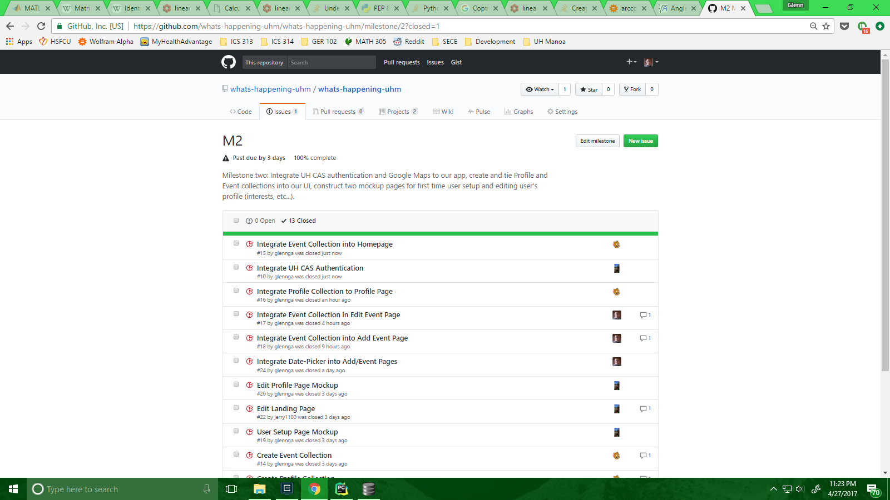

Milestone 2 consists of several issues, and our progress is managed with the [What's Happening GitHub Project M2](https://github.com/whats-happening-uhm/whats-happening-uhm/projects/2)

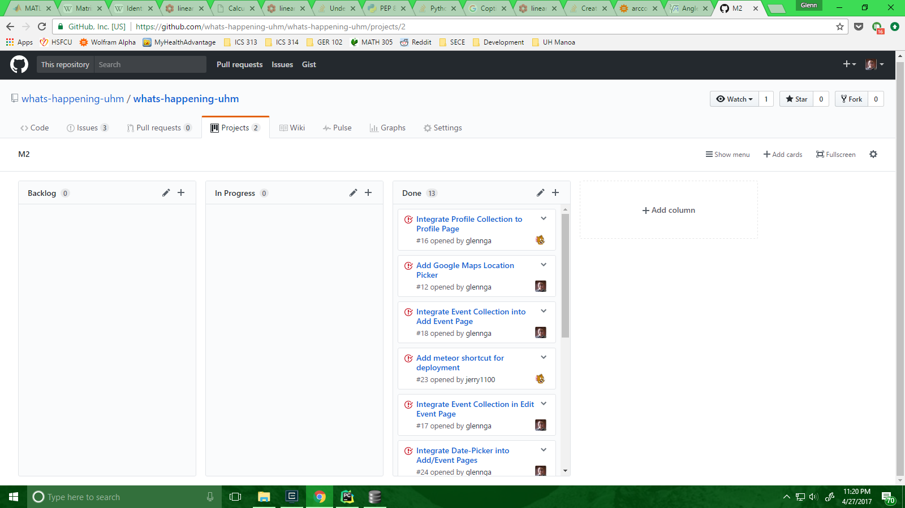

Each issue was implemented as its own branch, and merged into master when finished.

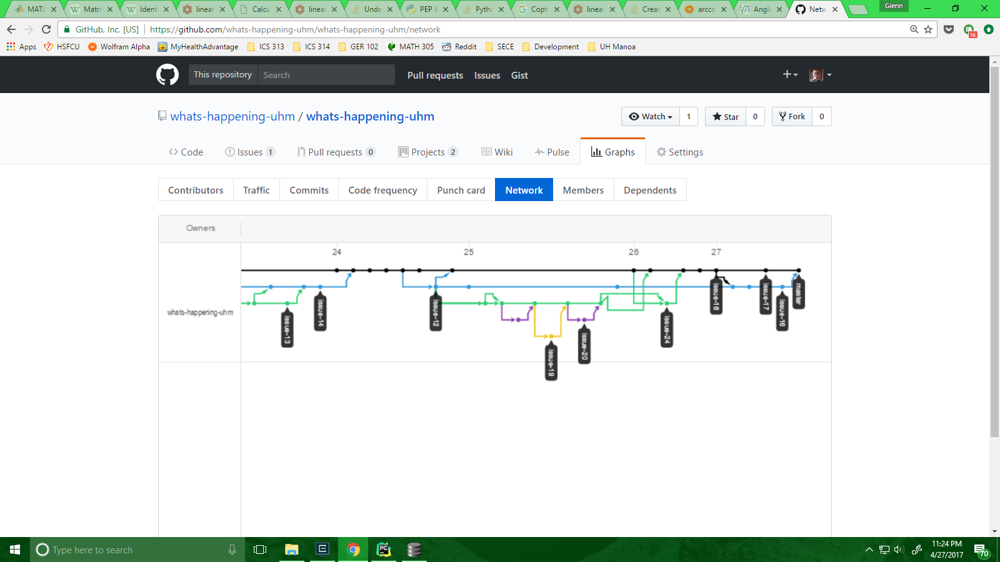

### Milestone 3: Functional Profile and Event Pages

This milestone started on April 28, 2017 and ended on May 9, 2017.

The goal of Milestone 3 was to ensure all pages interact with the Profile and Event collections appropriately.

The pages for adding and editing an event were merged into one, and security was added to prevent unauthorized users from editing non-owned events. The date and location picker are now fully functional. The profile and home pages now display events in the database, and the user can now click the event to view more information in a modal view. The user can now 'star' events and view their starred events. The profile adding/editing pages are now fully functional.

Milestone 3 is being implemented as [What's Happening GitHub Milestone M3](https://github.com/whats-happening-uhm/whats-happening-uhm/milestone/3).

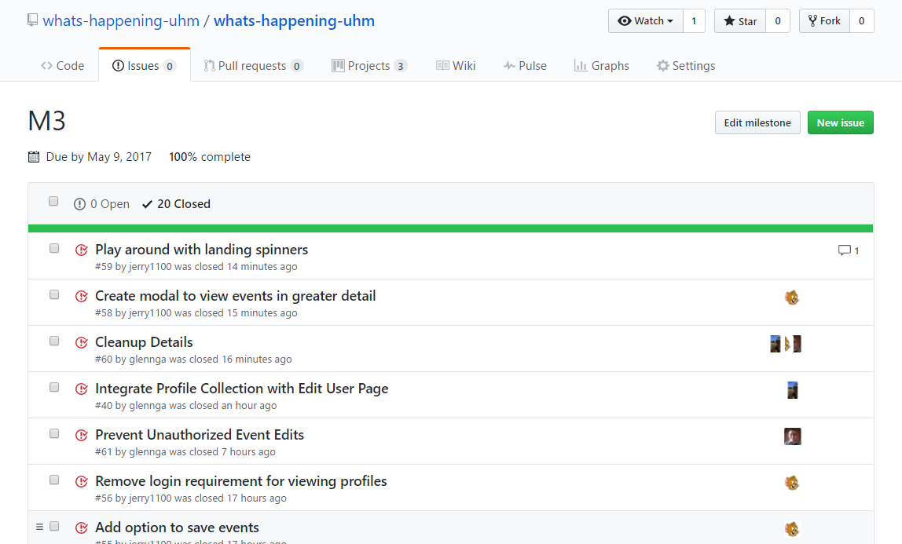

Milestone 3 consists of several issues, and our progress is managed with the [What's Happening GitHub Project M3](https://github.com/whats-happening-uhm/whats-happening-uhm/projects/3)

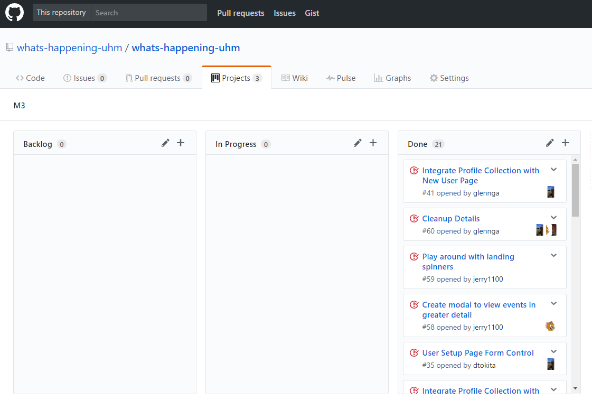

Each issue was implemented as its own branch, and merged into master when finished.

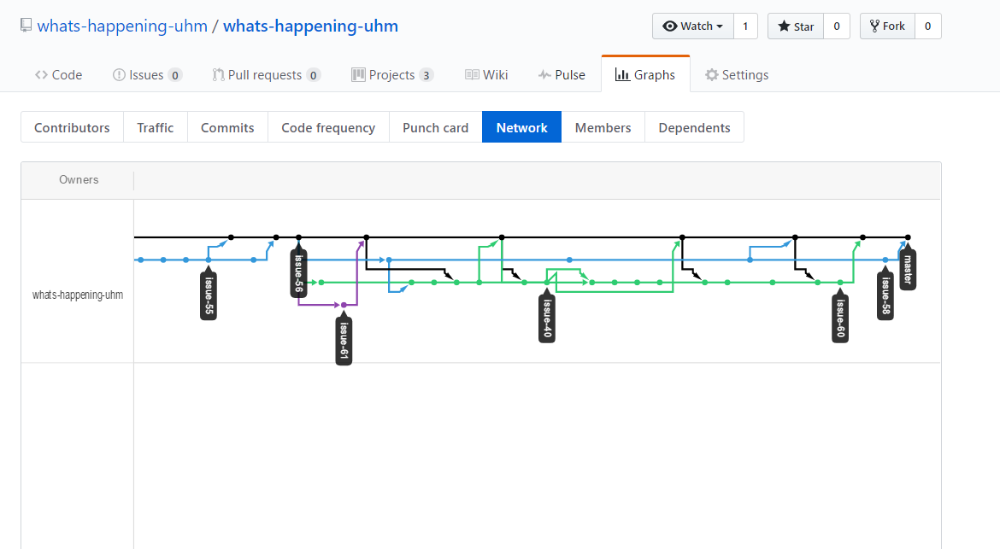
